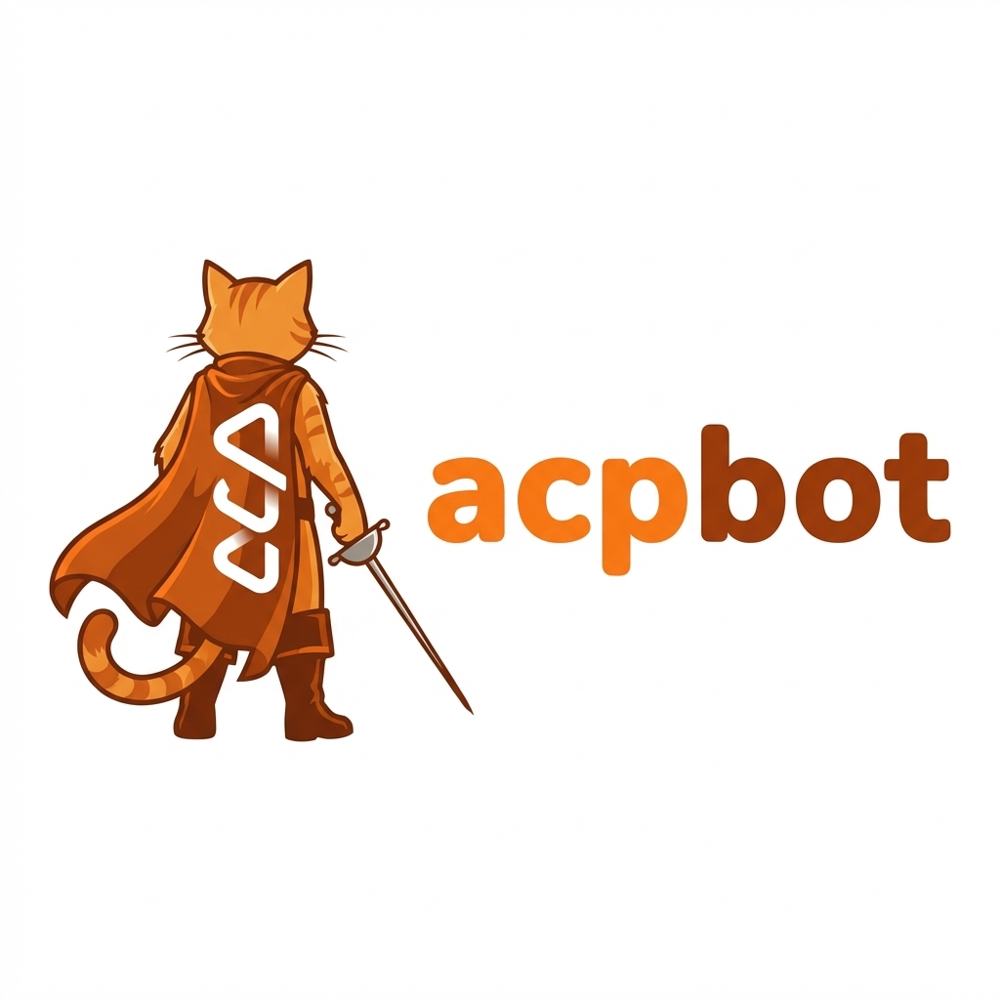

  
  <h1>acpbot</h1>
  

    ACP-based, channel-first AI runtime derived from nanobot.
  

  

    <a href="./README.md">English</a> | <a href="./README.zh-CN.md">简体中文</a>
  

  

    
    
  

## What Is acpbot

`acpbot` is this project's new identity.

This repository was born from the `nanobot` project and keeps nanobot's elegant inbound/outbound and channel architecture, while replacing the underlying agent runtime with an ACP (Agent Client Protocol) standard layer.

In short: this is no longer just a downstream nanobot branch for daily syncing; it is an ACP-first evolution for developer workflows.

## Why Refactor nanobot

Many OpenClaw-style services implement their own agent runtime. That works well for general assistants, but for developers, reusing mature presets and workflows from existing coding agents (such as Claude Code, Codex/OpenCode, and similar tools) is often a better fit.

So this project swaps out nanobot's original runtime core and introduces an ACP protocol layer instead.

## What You Get

- Keep nanobot's strong channel capabilities and inbound/outbound pipeline.
- Connect ACP-compatible coding agents and existing personal presets.
- Use it as a debuggable AI foundation for day-to-day engineering work.
- Manually take over sessions at any time, intervene, process, and hand control back.
- Preserve session records for transparent and controllable operations.

## Compatibility Notes

To avoid breaking existing users and tooling, code and command naming remain unchanged for now (for example, command names still use `nanobot`).

Branding and runtime direction have changed to `acpbot`, but the migration path stays practical and incremental.

## Current Development Status (2026-03)

Based on the current project docs (`docs/design`, `docs/issue`, `docs/research`, `docs/superpowers`), the ACP refactor is already production-usable on the core path and now in the final hardening stage.

### Completed and validated

- ACP runtime baseline and config model are documented and landed.
- Session resilience for oversized frames has been fixed.
- Telegram outbound batching and final-message deduplication are fixed.
- Inbound/outbound JSONL runtime logs support rotation and clean shutdown behavior.
- ACP observability hardening is completed (inbound dedupe, outbound JSON, gateway startup sharded logs).
- ACP session persistence, heartbeat broadcast, and cron session mode refactor are completed.
- Session list parsing/reconciliation and restart reactivation flow are fixed.
- ACP file transport unification baseline is done (media <-> ACP blocks, WS blob/path modes, 2MB limit, 100KB regression).
- ACP E2E smoke `E2E-000~003` is stable and passing.
- WS blob E2E (`E2E-WS-001~003`) is passing.

### In progress now

- FT real-chain implementation (TDD): inbound `resource_link` normalization + outbound plugin loop (`acp_send_file`) in `tests/acp_e2e`.
- ACP E2E backlog execution planning for D/E/F suites.
- Offline two-stage container deploy subproject is in progress.

### Known open gaps

- JSON-RPC coverage is incomplete in ACP client callbacks (`fs/read_text_file`, `terminal/*` behavior gaps).
- Permission flow is still policy-driven (`strict` / `trusted` / `yolo`) rather than channel-user interactive approval.
- `tool_call` context is not fully preserved for interactive approval UX.
- Several `session/update` types (`agent_thought_chunk`, `plan`, `usage_update`, etc.) are not yet fully routed end-to-end.

## Roadmap

### Phase 1 - File transport real-chain closure (current)

- Finish inbound media normalization to stable `resource_link` semantics.
- Complete outbound file return loop with canonical `acp_send_file` plugin fixture.
- Land and stabilize FT `E2E-FT-001~005` against real files and auditable tool events.

### Phase 2 - Permission and interaction model

- Preserve `session_id` + `tool_call` context through permission requests.
- Introduce channel-facing interactive approve/deny flow with timeout fallback.
- Keep current static policies as fallback, not as the primary UX.

### Phase 3 - Session/update and JSON-RPC coverage

- Expand `session/update` handling to thought/plan/usage/config/info command updates.
- Improve resilience for unexpected RPC calls when capabilities are disabled.
- Define and ratify ACP outbound `metadata` schema (field contract, compatibility level, migration path).
- Migrate dispatcher/runtime to emit typed `metadata` incrementally, with parity checks against native behavior.
- Close D/E/F backlog test suites in `tests/acp_e2e` with clear acceptance criteria.

### Phase 4 - Delivery hardening

- Finalize offline deployment artifacts and reproducible runbooks.
- Keep observability/audit outputs stable for troubleshooting and compliance.
- Maintain compatibility with the existing AgentLoop and native/acp dual-backend boundary.

## Acknowledgements

This project is derived from [nanobot](https://github.com/HKUDS/nanobot).

Special thanks to nanobot for providing the community with excellent inspiration and a compact, refined OpenClaw-style implementation.

## License

This project keeps the original license. See [LICENSE](./LICENSE).
